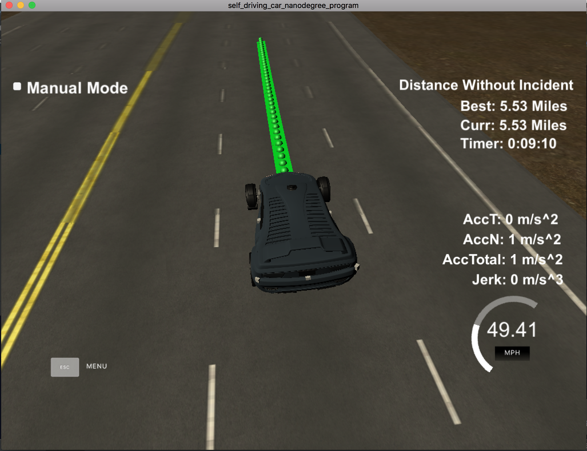
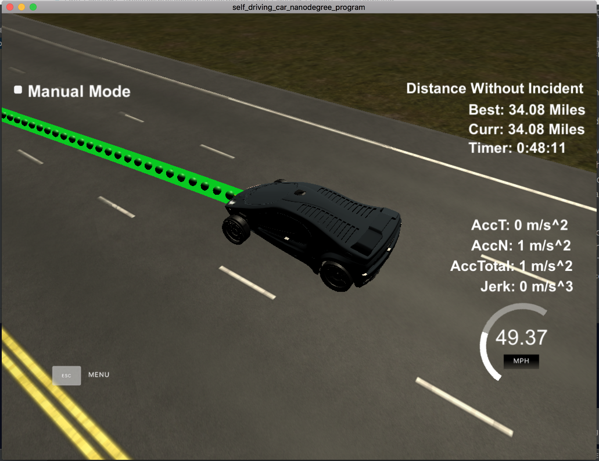

# CarND-Path-Planning-Project
Self-Driving Car Engineer Nanodegree Program
   
### Simulator.
You can download the Term3 Simulator which contains the Path Planning Project from the [releases tab (https://github.com/udacity/self-driving-car-sim/releases/tag/T3_v1.2).

### Goals
In this project your goal is to safely navigate around a virtual highway with other traffic that is driving +-10 MPH of the 50 MPH speed limit. You will be provided the car's localization and sensor fusion data, there is also a sparse map list of waypoints around the highway. The car should try to go as close as possible to the 50 MPH speed limit, which means passing slower traffic when possible, note that other cars will try to change lanes too. The car should avoid hitting other cars at all cost as well as driving inside of the marked road lanes at all times, unless going from one lane to another. The car should be able to make one complete loop around the 6946m highway. Since the car is trying to go 50 MPH, it should take a little over 5 minutes to complete 1 loop. Also the car should not experience total acceleration over 10 m/s^2 and jerk that is greater than 10 m/s^3.

#### The map of the highway is in data/highway_map.txt
Each waypoint in the list contains  [x,y,s,dx,dy] values. x and y are the waypoint's map coordinate position, the s value is the distance along the road to get to that waypoint in meters, the dx and dy values define the unit normal vector pointing outward of the highway loop.

The highway's waypoints loop around so the frenet s value, distance along the road, goes from 0 to 6945.554.

## Basic Build Instructions

1. Clone this repo.
2. Make a build directory: `mkdir build && cd build`
3. Compile: `cmake .. && make`
4. Run it: `./path_planning`.

Here is the data provided from the Simulator to the C++ Program

---

## Dependencies

* cmake >= 3.5
  * All OSes: [click here for installation instructions](https://cmake.org/install/)
* make >= 4.1
  * Linux: make is installed by default on most Linux distros
  * Mac: [install Xcode command line tools to get make](https://developer.apple.com/xcode/features/)
  * Windows: [Click here for installation instructions](http://gnuwin32.sourceforge.net/packages/make.htm)
* gcc/g++ >= 5.4
  * Linux: gcc / g++ is installed by default on most Linux distros
  * Mac: same deal as make - [install Xcode command line tools]((https://developer.apple.com/xcode/features/)
  * Windows: recommend using [MinGW](http://www.mingw.org/)
* [uWebSockets](https://github.com/uWebSockets/uWebSockets)
  * Run either `install-mac.sh` or `install-ubuntu.sh`.
  * If you install from source, checkout to commit `e94b6e1`, i.e.
    ```
    git clone https://github.com/uWebSockets/uWebSockets 
    cd uWebSockets
    git checkout e94b6e1
    ```


## Rubric

### Compilation
I downloaded [`spline.h`](http://kluge.in-chemnitz.de/opensource/spline/) according to the QA session and put it to `src` folder. The compilation went through.

### Valid Trajectories
The car is able to drive without any incidents for at least 4.32 miles. I made a [`video`](https://www.youtube.com/watch?v=4fXXjHxP1uE) on YouTube. Below are the screenshots while the ego vehicle was driving.




The criteria include the following:
1. The car drives according to the speed limit.
    * No speed limit reg flag was seen.
2. Max Acceleration and Jerk are not Exceeded.
    * No max jerk red flag was seen.
3. Car does not have collisions.
    * No collision red flag was seen.
4. The car stays in its lane, except for the time between changing lanes.
    * Most of time the car stays in its lane unless there is a car ahead of it, or need to merge onto the center lane.
5. The car is able to change lanes
    * The car is able to change lane when there is a slower car ahead of it and no traffic around, or needs to change back to center lane if and only if there is no traffic around.

### Reflection
The starter code is leveraged from the QA session. The algorithm starts from line 245 of [`main.cpp`](src/main.cpp#L245).

From line 245-289 I implemented the code to determine whether there is a car ahead of the ego car, left to the car or right to the car. The condition is met if the distance measured from the sensors is within 30m from the ego car.

Line 291-314 decides whether the car needs to change lane. There are two conditions below and if either one is met the car changes lane.
1. There is a slower car ahead and there is no left/right car within 30m.
2. The car is on the left/right lane and wants to change back to the center lane, and there is no cars on the direction it wants to merge on.
Line 310-313 is used when the car is about to start. This is to avoid the high jerk when the car starts to reach the max speed.

Line 321-420 calculate the trajectory points. The car orientation is calculated from the last two points of the previous path points. Then there are three points at farther distances are included for the spline calculation.
